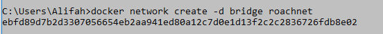

# Laporan Praktikum Pertemuan 5

1. Install Docker di laptop.
2. Buka terminal.
3. Menjalankan perintah pull image cockroachdb, dan tunggu hingga proses selesai(membutuhkan waktu yang lama).

4. Membuat Bridge Network pada Docker.

5. Menjalankan perintah service cockroachdb.

6. Memastikan Container dalam keadaan Up.

7. Test Cluste.

8. Membuat database.

9. Melihat database yang telah dibuat dan memilih database yang akan digunakan.

10. Membuat table mhs di dalam database alifah.

11. Menginputkan data ke dalam database mhs.

12. Melihat isi tabel.
1
