# Deploying First Container

1. Ketikan docker search redis

2. Ketikkan docker run -d redis

3. Ketikkan docker ps

4. Ketikan docker inspect compassionate_curran

5. Ketikkan docker logs compassionate_curran

6. Ketikkan docker run -d --name redisHostPort -p

7. Ketikkan docker run -d --name redisDynamic -p

8. Ketikkan docker port redisDynamic
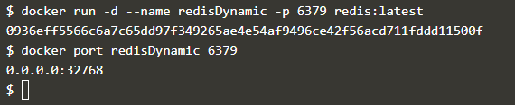
9. Lalu ketikkan docker ps lagi
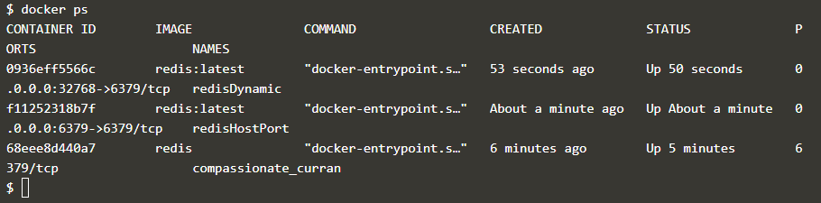
10. Ketikkan docker run -d --name redisMapped -v /
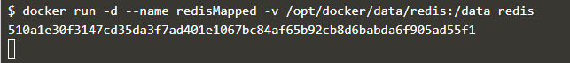
11. Ketikkan docker run ubuntu ps
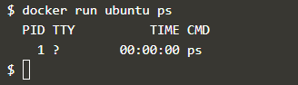
12. Terakhir ketikkan docker run -it ubuntu bash
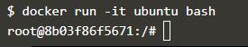

# Create nginx static web server

1. Copykan syntax yang ada pada editor , kemudian ketikkan docker build -t webserver-image:v1
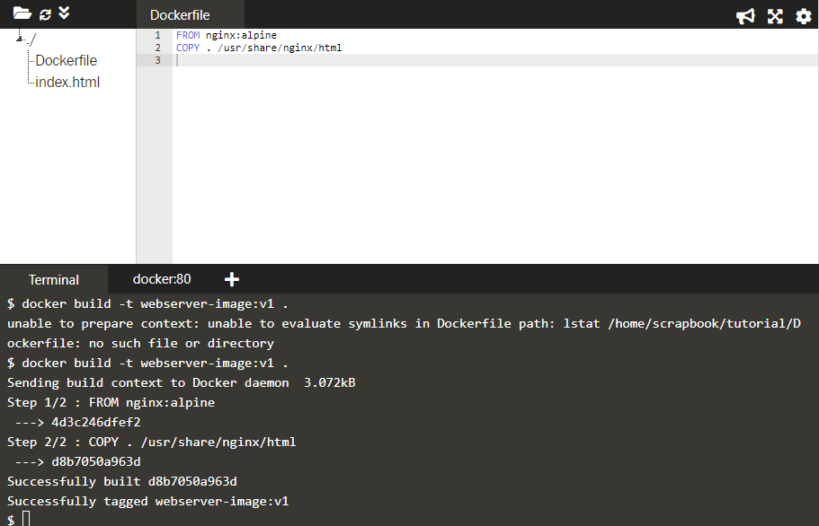
2. Kemudian ketikkan docker images
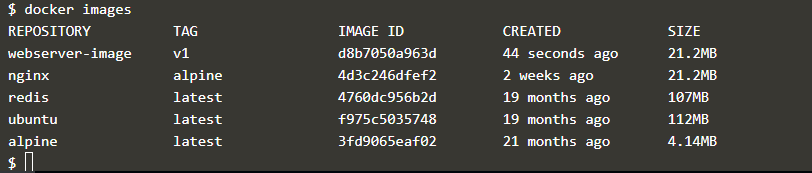
3. Kemudian docker run -d -p 80:80 webserver-image:v1
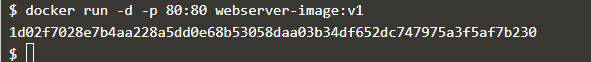
4. Ketikkan curl Docker
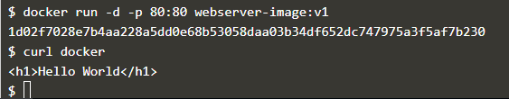

# Building Container image

1. Copykan yang ada pada editor
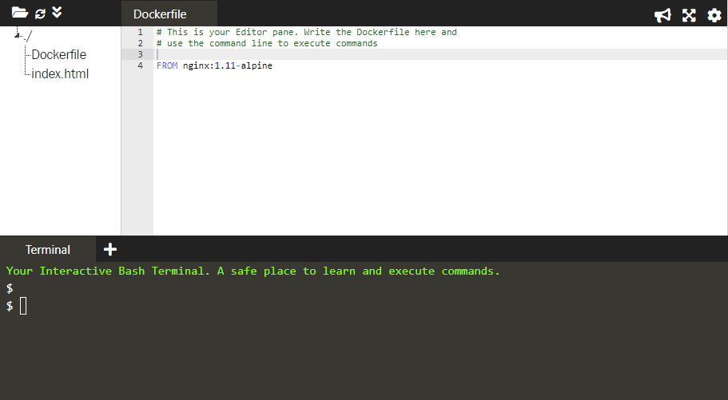
2. Copykan yang ada pada editor selanjutnya
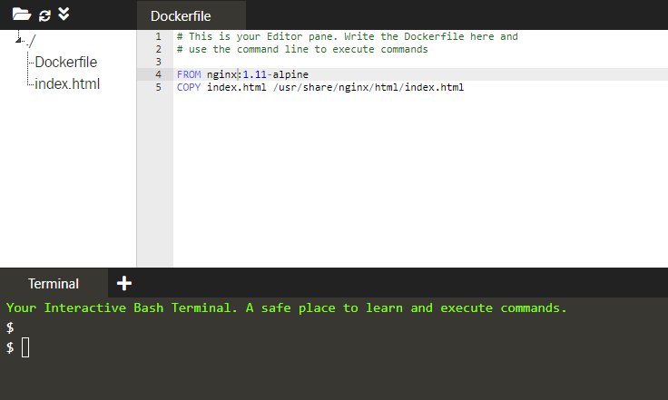
3. Copykan yang ada pada editor selanjutnya
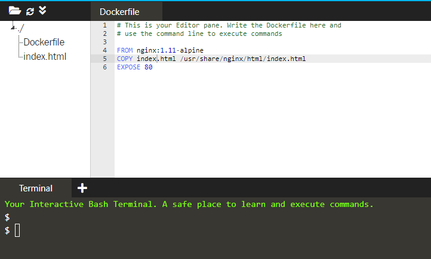
4. Ketikkan docker images
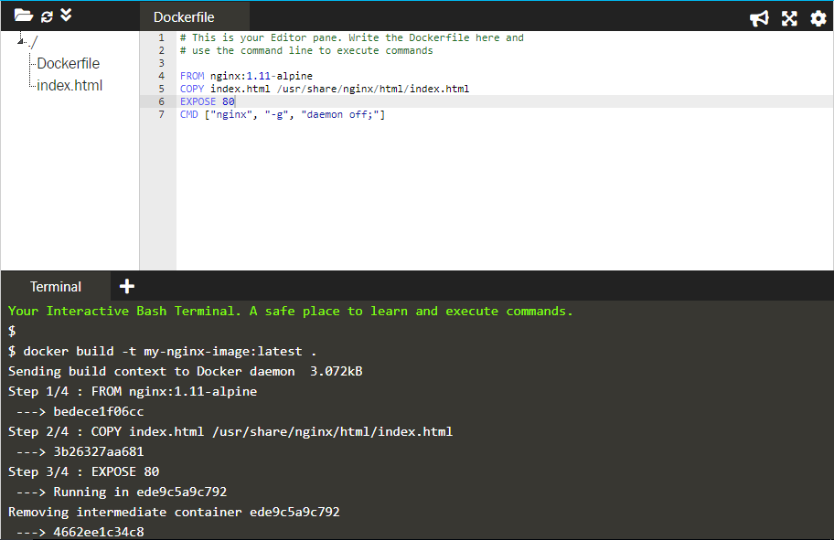
5. Ketikkan docker run -d -p 80:80 my-nginx-image:lates
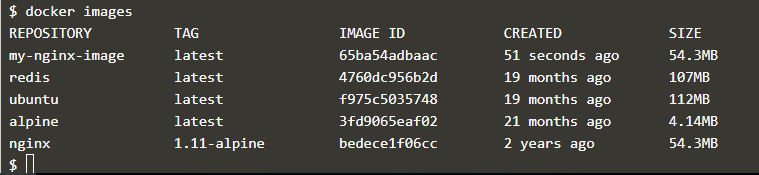
6. Ketikkan docker ps
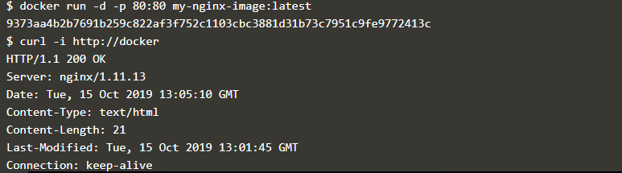
