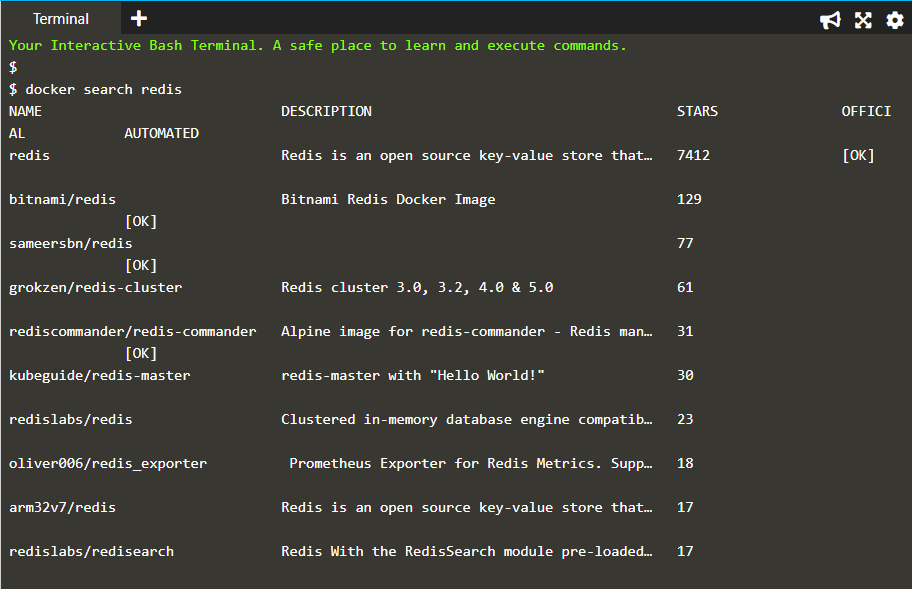
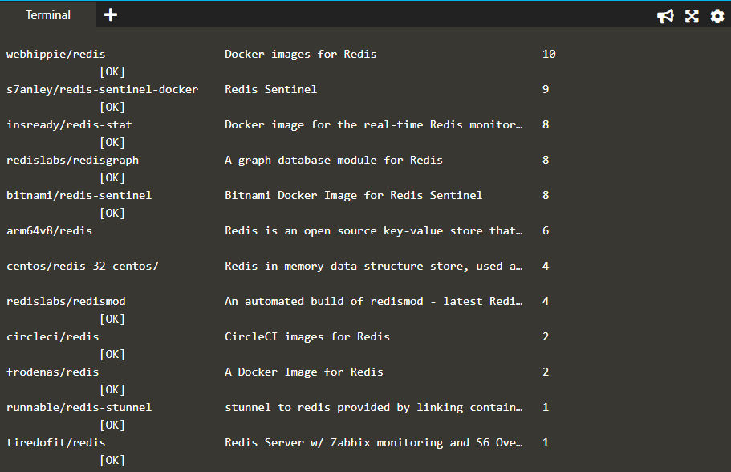
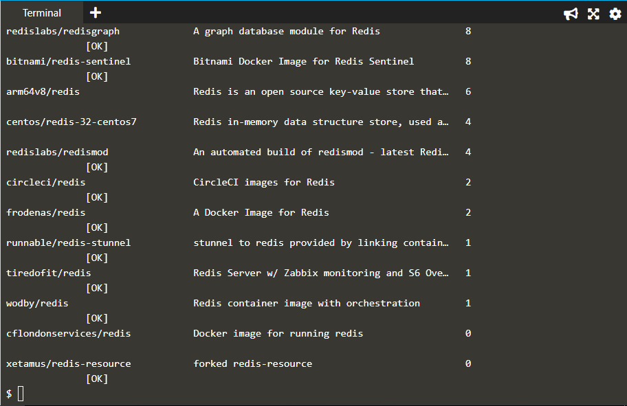
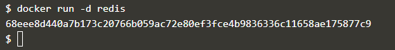
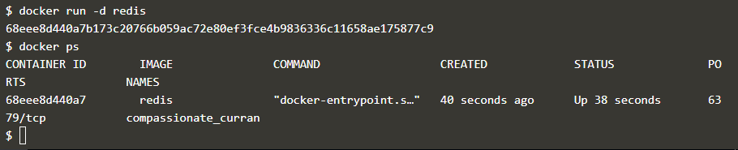
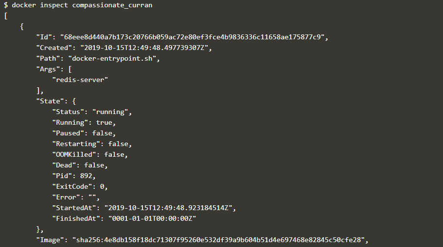
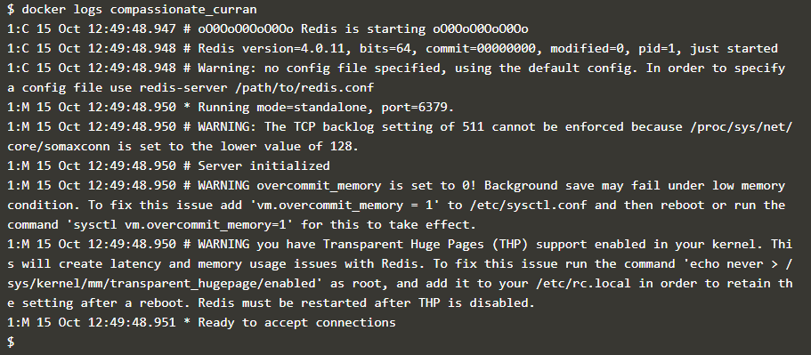
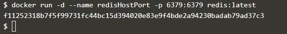
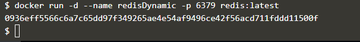

# Deploying First Container

1. Ketikan docker search redis

2. Ketikkan docker run -d redis

3. Ketikkan docker ps

4. Ketikan docker inspect compassionate_curran

5. Ketikkan docker logs compassionate_curran

6. Ketikkan docker run -d --name redisHostPort -p

7. Ketikkan docker run -d --name redisDinamic -p

8. 
