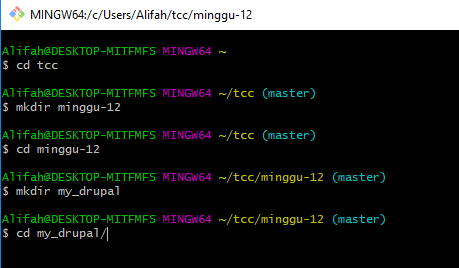
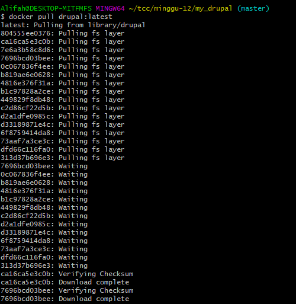
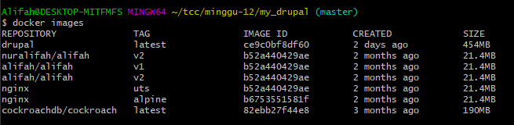
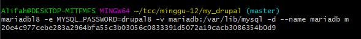
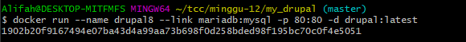
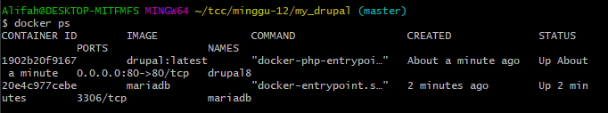

#Laporan 12

#Docker Compose dengan Drupal

1. Membuat folder my_drupal

2. Install Drupal
docker pull drupal:latest

3. Cek docker images

4. Now we run Drupal container with a link to just created MariaDB and the binding to the 80-th port. The link is just a record in /etc/hosts specifying IP of the container with MariaDB in a virtual network created by Docker during its installation

5. Lihat Container

